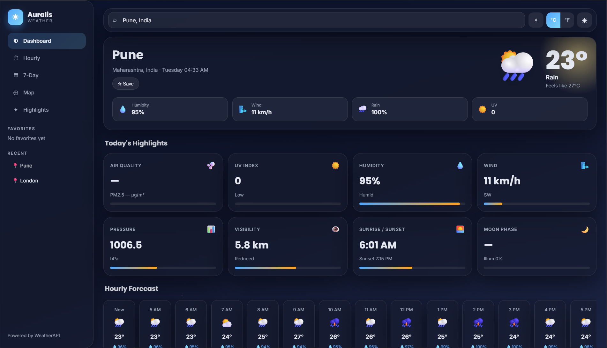

<div align="center">


# 🌦️ Auralis Weather Dashboard

### Beautiful Weather Application built using HTML, CSS & JavaScript

<p>

<a href="https://pradyum-02.github.io/Auralis-whether-dashboard/">


</a>

</p>

</div>

---

# 📖 About

Auralis Weather Dashboard is a clean and responsive weather application that fetches real-time weather information using the WeatherAPI. Users can search any city and instantly view current weather conditions.

---

# ✨ Features

- 🔍 Search Any City
- 🌡 Current Temperature
- 💧 Humidity
- 🌬 Wind Speed
- 🌥 Weather Conditions
- 📱 Responsive Design
- ⚠ Error Handling
- ⚡ Fast API Fetching

---

# 🛠 Tech Stack

<div align="center">


</div>

---

## 📸 Preview

<p align="center">
  
</p>

---

# 📂 Folder Structure

```text
Auralis
│
├── images
├── index.html
├── style.css
├── script.js
└── README.md
```

---

# 🚀 Getting Started

```bash
git clone <repository-url>

cd Auralis-Weather-Dashboard

Open index.html
```

---

# 🎯 Future Improvements

- 📅 7-Day Forecast
- 📍 Geolocation
- 🌙 Theme Toggle
- 🕒 Hourly Forecast
- 🗺 Weather Maps
- 🌫 Air Quality Index

---

# 👨‍💻 Author

**Pradyum Meshram**

Crafted with love & A lot of Coffee.

---

<div align="center">

⭐ Thanks for checking out this project!

</div>

<div align="center">


</div>
